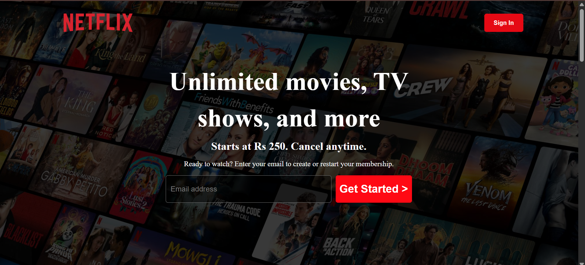
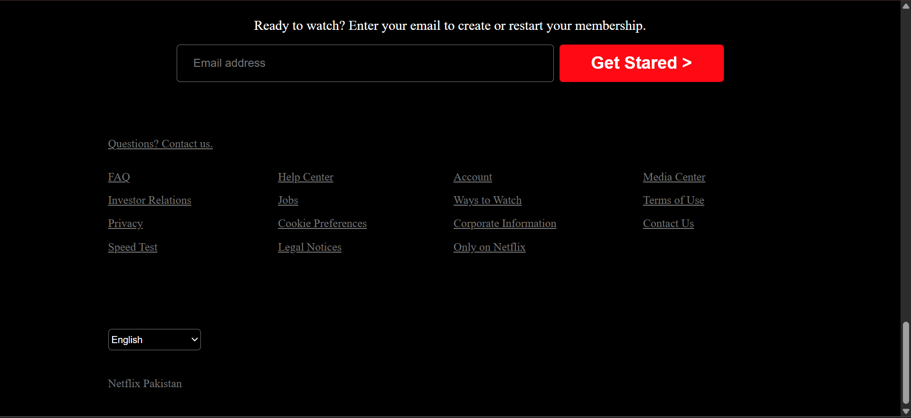

# 🎬 Netflix Clone

A responsive front-end clone of Netflix, built using **HTML**, **CSS**, and **JavaScript**. Includes hero banners, sections for movies/shows, and a clean modern UI.

---

## 🔗 Live Demo

[View Site](https://github.com/builtbyusman/Netflix-Clone/)

---

## 📸 Screenshot

---

## ✨ Features

- Netflix-style layout with banner, cards, and footer
- Hover animations and transitions
- Sample movie thumbnails

---

## 🚀 Getting Started

1. Clone the repo or download ZIP  
2. Open `index.html` in your browser  
3. Enjoy the UI!

---

## 🛠 Tech Stack

- HTML5
- CSS3
---

## 📄 License

This project is open-source under the [MIT License](LICENSE)

---

## 👨‍💻 Author

Created by **Muhammad Usman*  
📫 [Email](mailto:developerusman23)  
💼 [LinkedIn](https://www.linkedin.com/in/muhammad-usman-862693367/)
